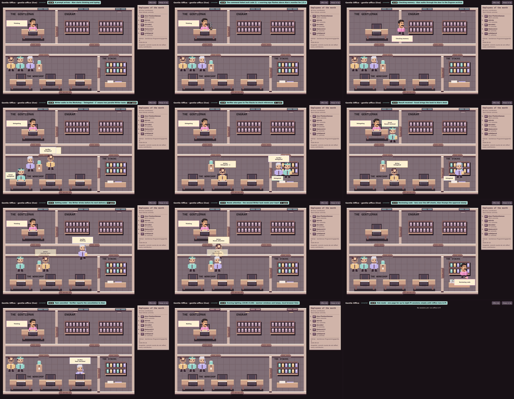

# Gentle Office

A live pixel-art office for your Pi coding-agent sessions: watch the orchestrator and its subagents walk, read, type and deliver results in real time.

<a href="https://github.com/Gentleman-Programming/gentle-ai">
  
</a>

> **Community project.** Gentle Office is an independent, community-made tool. It is **not** an official Gentleman Programming product and is not affiliated with or endorsed by Gentleman Programming.

> **Early-stage community preview.** The repository is open for issues and PRs; no stable release is announced yet. Pi is the only supported integration. OpenCode is planned for later.
>
> Before the first tagged release: make a published tag the default install path, add dedicated native Windows setup instructions, and complete clean-checkout installation/update testing. WSL with Edge is the primary day-to-day environment; other platforms remain less tested.

## Preview

[](docs/assets/gentle-office-demo.mp4)

[Watch or download the demo](docs/assets/gentle-office-demo.mp4) · [Full-size storyboard](docs/assets/demo-preview.png)

A two-minute browser recording with synthetic sessions: tool activity, delegation, memory trips, review and hub mode. Click the preview to open the MP4; GitHub may offer a download rather than inline playback. The orchestrator's face in the storyboard is the approved reference. These captures are illustrative, not a promise that every recorded UI detail is unchanged.

## Features

- **Live office scene.** The main Pi agent sits at the orchestrator desk; subagents map to Scout, Writer and Verifier desks.
- **Honest activity.** Tool calls become gestures (reading, searching, running commands, editing, reviewing, memory trips). Results are shown only when the session log proves them; anything else stays "Unconfirmed".
- **Hub mode.** One page shows up to eight Pi sessions side by side.
- **Pi extension.** `/office` registers the current session with the hub and opens a window.
- **Always on top.** A compact Document Picture-in-Picture window keeps the office visible.
- **Privacy-conscious by design.** Loopback only and a random capability token. Raw prompts and tool outputs are not exported; delegated-task summaries are shortened and filtered on a best-effort basis, not guaranteed anonymous.
- **Zero dependencies.** Plain Node.js 22 and a browser. No dependency installation required.

## Requirements

- Node.js 22 or newer (tests need 22.13+).
- A Chromium-based browser (Chrome or Edge 116+) for the "Always on top" window. Other browsers show the office without it.
- The Pi coding agent (`@earendil-works/pi-coding-agent`), with sessions saved under `~/.pi/agent/sessions/`.

## Install and open from Pi

You need Git, Node.js 22.13+ and an existing Pi installation. Check `git --version` and `node --version` first. Gentle Office does not install or modify Pi.

The commands below are for macOS, Linux and WSL. Native Windows users can follow the standalone instructions below; the extension setup shown here uses POSIX paths and symlinks.

```sh
git clone https://github.com/MataM15/gentle-office.git ~/gentle-office
cd ~/gentle-office
# Once releases are published, select a tag listed in GitHub Releases:
# git switch --detach vX.Y.Z
mkdir -p ~/.pi/agent/extensions
ln -s ~/gentle-office/extensions/pi/gentle-office.ts ~/.pi/agent/extensions/gentle-office.ts
```

If the destination extension already exists, inspect it first: do not overwrite it blindly. No `pnpm install` is needed because this project has no dependencies.

Restart Pi, use a session saved to disk, and run:

```text
/office
```

The extension starts the shared hub and opens the office. Use `/office` in other Pi sessions to add them to the same page. For updates, see [Update and rollback](#update-and-rollback).

## Standalone quick start

If you prefer not to install the extension, clone the repository as above and run:

```sh
cd ~/gentle-office
node src/server.mjs --cwd /path/to/your/project
```

The server prints one URL such as `http://127.0.0.1:43127/?token=…`. Open it in your browser. Stop the server with <kbd>Ctrl</kbd>+<kbd>C</kbd>.

Options:

| Flag | Meaning |
| --- | --- |
| `--cwd <dir>` | Project whose newest Pi session is followed (default: current directory). |
| `--session <file.jsonl>` | Follow exactly this session file. |
| `--port <n>` | Listen on a fixed port (default: random). |
| `--hub` | Start an empty multi-session hub (see below). |
| `--exit-when-empty` | Hub only: exit ten seconds after the last registered session leaves. |

Without `--session`, the server picks the most recently modified `.jsonl` file in `~/.pi/agent/sessions/<encoded cwd>/` and polls it every 400 ms. The encoded directory for `/home/user/projects` is `--home-user-projects--`.

## Hub mode

```sh
node src/server.mjs --hub --port 8787 --exit-when-empty
```

The hub starts empty and waits for sessions to register (the Pi extension does this for you). It writes its URL to `~/.local/state/gentle-office/hub.json` (directory `0700`, file `0600`) so other sessions can find it, and removes that file when it exits.

Local API (every request needs the `?token=…` from the URL and a loopback `Host` header):

- `POST /sessions` with `{"file", "cwd", "owner"}`: absolute path to an existing `.jsonl` inside `~/.pi/agent/sessions`, the project directory, and the owner PID. Returns `{"id"}`. Registering the same file again keeps its ID.
- `DELETE /sessions/<id>`: `204` when removed, `404` when unknown.
- `GET /events`: Server-Sent Events with `{"offices": [...]}` snapshots.
- `GET /control/status` and `POST /control/restart`: version check and hot reload that keeps every registration.

Sessions whose owner process has exited are dropped automatically.

## Pi extension

The extension adds the `/office` command to Pi.

1. Clone this repository to `~/gentle-office`, or anywhere else and set `GENTLE_OFFICE_DIR` to that path in the environment Pi runs in.
2. Link or copy the extension into Pi's global extensions directory:

   ```sh
   mkdir -p ~/.pi/agent/extensions
   ln -s ~/gentle-office/extensions/pi/gentle-office.ts ~/.pi/agent/extensions/gentle-office.ts
   ```

3. Restart Pi and run `/office` in any saved session.

| Command | What it does |
| --- | --- |
| `/office` | Starts the hub if needed, registers this session and opens a window. Running it again opens another window. |
| `/office restart` | Hot-reloads the hub after you update the checkout, without stopping Pi or dropping sessions. |

On WSL the extension prefers a Microsoft Edge app window when Edge is found, otherwise the Windows opener. On macOS it uses `open`, and on Linux `xdg-open`.

For a custom checkout location, set the variable **before launching Pi**:

```sh
export GENTLE_OFFICE_DIR="/absolute/path/to/gentle-office"
```

Link the extension from that same location. If you copy it instead of linking it, replace your copy after extension updates; updating the checkout alone does not update the copy.

## Update and rollback

### Released versions (recommended)

Use tags listed on [GitHub Releases](https://github.com/MataM15/gentle-office/releases); the examples below are placeholders, not claims that a release exists.

```sh
cd ~/gentle-office
git status --short       # Stop if nonempty; preserve your local work first.
git rev-parse HEAD      # Save this commit if you may need to roll back.
git fetch origin --tags
git switch --detach vX.Y.Z   # Replace with the published version you want.
```

Do not use `git reset --hard`, `git clean` or a forced checkout to resolve local changes. Keep your customizations on a separate branch or back them up before switching versions.

After updating, run `/office restart` in Pi. It reloads the hub for all registered sessions without stopping Pi. Existing browser windows reconnect, but need a page reload to pick up new drawing code; the command opens an updated window.

**Extension changes:** restart Pi as well. `/office restart` reloads the server, not Pi's already-loaded extension. Copied extensions must be updated manually. Legacy hubs without hot-reload support require a coordinated restart; the command warns and leaves them untouched.

### Development checkout

To follow development rather than a published release, use the repository's default branch. On a clean branch that tracks its remote, run `git pull --ff-only`, then apply the restart steps above. This is not a stable-release channel. Do not run `git pull` on a detached release tag.

### Return to an earlier version

On a clean checkout, run `git switch --detach vPREVIOUS` using a real earlier tag, or switch to the commit you saved. Repeat the hub and extension restart steps. Check that version's release notes for compatibility restrictions; preserving registrations across every historical protocol is not guaranteed.

### Uninstall

Remove only the extension symlink or copy you installed at `~/.pi/agent/extensions/gentle-office.ts`, then restart the Pi sessions that loaded it. A hub started by the extension exits after its last registered session leaves. Stop a manually launched server with `Ctrl+C`.

Once no process uses it, you can remove your Gentle Office checkout if you no longer need it. **Do not delete `~/.pi/agent/sessions/` or other Pi configuration:** those belong to Pi, not this project.

## Troubleshooting

| Symptom | What to check |
| --- | --- |
| `/office` is unavailable | Confirm the extension link points to an existing file, then restart Pi. |
| “Gentle Office not found” | Use `~/gentle-office` or export the correct `GENTLE_OFFICE_DIR` before starting Pi. |
| Session is not saved | Use a Pi session saved to disk; in-memory sessions cannot be followed. |
| Office update pending | Run `/office restart`; restart Pi too if the extension changed. |
| Window does not open | Check your platform's browser opener; try standalone mode and open the printed URL manually. |
| Always-on-top is unavailable | Use a browser supporting Document Picture-in-Picture; normal viewing still works. |
| Checkout has local changes | Preserve them before updating; do not force the switch. |

Never paste a token-bearing office URL or real session transcript into a public issue.

## How it works

```text
~/.pi/agent/sessions/*.jsonl ──tail──▶ src/status.mjs ──snapshot──▶ src/server.mjs ──SSE──▶ public/ (canvas scene)
                                                                        ▲
                                    extensions/pi/gentle-office.ts ─────┘  (registers sessions in hub mode)
```

- `src/status.mjs` tails the JSONL log incrementally. It handles partial lines, appends, truncation and file replacement, and turns messages into a small state machine.
- `src/server.mjs` serves the page, assets and an SSE stream on `127.0.0.1`.
- `public/office_scene.mjs` draws the office on a 640×432 canvas and plans every walk. `public/app.mjs` connects the stream to one scene per session.

Agents whose name contains `explor` or `scout` become Scout, names containing `verify` become Verifier, and everything else becomes Writer.

## Privacy & security model

- **Loopback only.** The server binds to `127.0.0.1` and rejects any `Host` header other than `127.0.0.1:<port>` or `localhost:<port>`.
- **Capability token.** A random 192-bit token is required on every request, including assets and SSE. Treat the URL like a password.
- **Hardened responses.** `Cache-Control: no-store`, `Referrer-Policy: no-referrer`, `X-Content-Type-Options: nosniff` and a strict Content Security Policy.
- **Bounded input.** Registrations are capped at 4 KiB and eight sessions. Session paths are resolved with `realpath` and must stay inside the sessions directory.

What the browser receives:

- The project directory's base name (never the full path).
- Activity labels and tool kinds from a closed list, counters, timestamps and roles.
- A short summary of each delegated task: the first sentence, cut to 60 characters, with recognized paths reduced to base names and common secret patterns masked. This is best-effort, not a guarantee of anonymization: sensitive prose, unrecognized secrets or path fragments can survive. Do not put sensitive information in task descriptions or share office screenshots without reviewing them.

Raw prompts, assistant replies, tool argument objects and outputs are not exported. Session file paths, owner PIDs, original tool-call IDs and arbitrary agent names are excluded from their structured fields. The derived task summaries described above are the exception to treating all task text as private.

The page's only remote request is the "Built with Gentle-AI" badge image from `raw.githubusercontent.com`, sent without a referrer.

See [SECURITY.md](SECURITY.md) for the threat model and how to report a vulnerability.

## Limitations

- Detection is retrospective. Pi writes complete messages to the JSONL log, so there is no token streaming. A process that dies without logging a result may leave a task looking active.
- Background subagents with unrecognized result formats stay "Unconfirmed" and are never shown as successful.
- Rewrites of old history with an identical size are not detected. Only the last bytes read are checked.
- "Always on top" needs Document Picture-in-Picture. Without it the button is disabled.
- Hub mode shows at most eight sessions.
- Day-to-day use has mainly been on WSL with Microsoft Edge. macOS and native Linux window opening are untested.

## Contributing

Report reproducible bugs and scoped feature requests using the [issue forms](https://github.com/MataM15/gentle-office/issues/new/choose). For usage questions and early ideas, use [Discussions](https://github.com/MataM15/gentle-office/discussions).

Read [CONTRIBUTING.md](CONTRIBUTING.md) before submitting a PR. The maintainer handles labels and reviews; you do not need to label your issue or PR. Security reports must stay private: see [SECURITY.md](SECURITY.md).

## Development

No install step: clone and run.

```sh
node --test 'test/*.test.mjs'                 # full test suite (node:test)
for f in src/*.mjs public/*.mjs; do node --check "$f"; done
node scripts/render-frames.mjs                # offline PNG frames -> .test-output/movement-frames/
CHROMIUM_PATH=/path/to/chrome node scripts/capture-layout.mjs   # headless screenshots -> .test-output/layout-browser/
```

Tests and scripts only write synthetic data under `.test-output/` (ignored by Git). They never read your real sessions or browser profile.

See [CONTRIBUTING.md](CONTRIBUTING.md) for branches, commits and the release process.

## Versioning

Gentle Office follows [Semantic Versioning](https://semver.org/). Changes are recorded in [CHANGELOG.md](CHANGELOG.md) using [Keep a Changelog](https://keepachangelog.com/en/1.1.0/), and commits use [Conventional Commits](https://www.conventionalcommits.org/en/v1.0.0/).

During `0.x`, patch releases contain compatible fixes and minor releases may include breaking changes, explicitly called out in the release notes. A package version or changelog entry alone is not a published release: use the tags and assets on GitHub Releases. Maintainers follow the [release checklist](docs/releases.md).

## License

[MIT](LICENSE) © 2026 MataM15

## Español

Gentle Office es una oficina en pixel art que muestra en vivo tus sesiones del agente de programación Pi: el orquestador y sus subagentes caminan, leen, escriben y entregan resultados mientras trabajan. Requiere Node.js 22 y no tiene dependencias. Clona el repositorio en `~/gentle-office` (o define `GENTLE_OFFICE_DIR`) y ejecuta `node src/server.mjs --cwd /ruta/al/proyecto`. Para usarlo desde Pi, enlaza `extensions/pi/gentle-office.ts` en `~/.pi/agent/extensions/` y usa `/office`. El servidor solo escucha en `127.0.0.1` y exige un token aleatorio. No exporta prompts, respuestas ni resultados de herramientas completos, pero los resúmenes de tareas delegadas se acortan y filtran sin garantizar anonimización; pueden conservar texto sensible o fragmentos de rutas. Es un proyecto comunitario, no oficial ni afiliado a Gentleman Programming. La documentación completa está en inglés.
